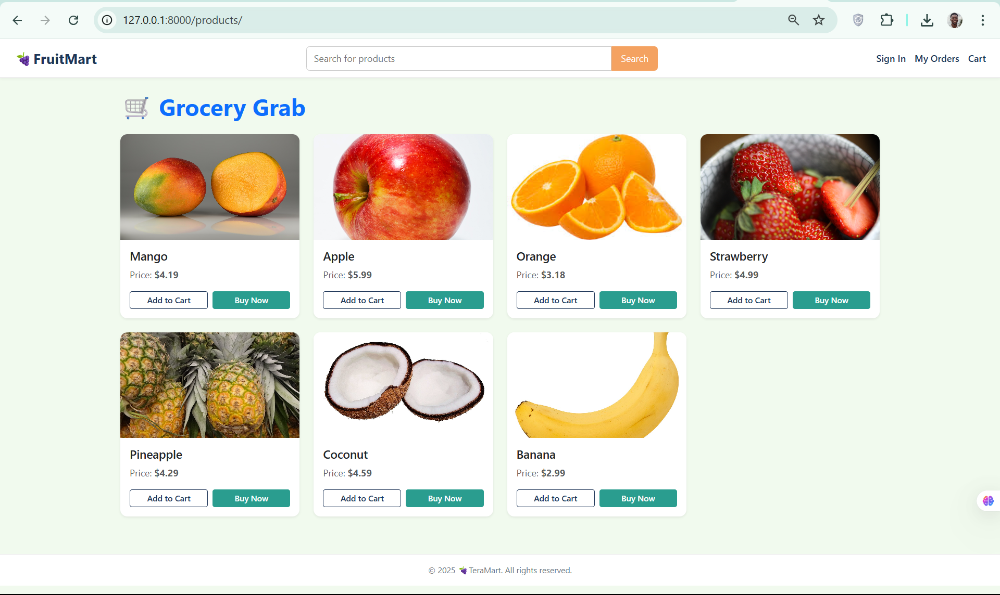
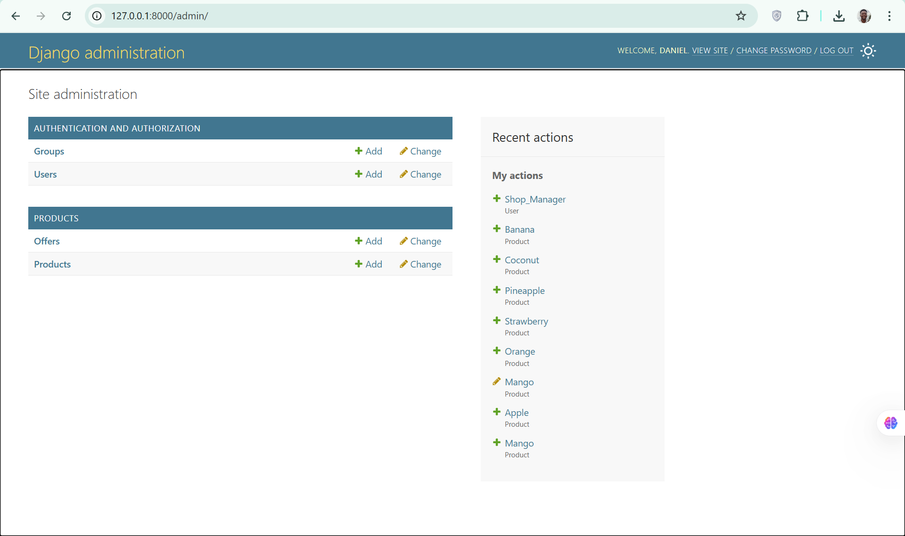

### ✅ **Refined & Professional README**

# 🛒 FruitMart – Django-Based Grocery E-Commerce Store

**FruitMart** is a responsive, modular e-commerce web application designed for grocery and fresh produce browsing. Built with Django and Bootstrap, it features a scalable architecture suitable for small-to-mid-scale digital storefronts. Ideal for developers looking to learn or build upon Django’s e-commerce capabilities.



---



---

## 🚀 Key Features

### ✅ Implemented

* 🧺 Dynamic product catalog with images, descriptions, prices, and stock tracking
* 🏷️ Offer and discount system managed via Django Admin
* 📱 Mobile-first responsive UI using Bootstrap 5
* 🔧 Admin dashboard for managing products and promotions

### 🛠️ In Development

* 🛒 Shopping cart and secure checkout
* 👤 User registration, login, and profile management
* 🔍 Product search, filtering, and sorting
* 📦 Order placement and confirmation
* 🌐 REST API for product and order endpoints

---

## 🧰 Tech Stack

| Layer       | Technology                    |
| ----------- | ----------------------------- |
| Frontend    | HTML5, CSS3, Bootstrap 5      |
| Backend     | Django 4.x, Django ORM        |
| Database    | MySQL (default), SQLite (dev) |
| Admin Panel | Django Admin                  |
| Versioning  | Git, GitHub                   |

---

## 🗂️ Project Structure

```text
FruitMart/
├── grocery_shop/                # Django project config
│   └── settings.py, urls.py, etc.
├── products/                    # App: catalog & offers
│   └── models.py, views.py, admin.py
├── templates/                   # Global and app-specific templates
├── static/                      # Static files (CSS, JS, images)
├── media/                       # Uploaded product media
├── requirements.txt             # Dependencies
└── db.sqlite3                   # SQLite DB (dev only)
```

---

## ⚙️ Getting Started

### 1. Clone the Repository

```bash
git clone https://github.com/daniel-agblevor/FruitMart.git
cd FruitMart
```

### 2. Set Up a Virtual Environment

```bash
python -m venv venv
# Activate (Windows)
venv\Scripts\activate
# Activate (macOS/Linux)
source venv/bin/activate
```

### 3. Install Dependencies

```bash
pip install -r requirements.txt
```

### 4. Configure the Database

#### For local development (SQLite):

In `grocery_shop/settings.py`:

```python
DATABASES = {
    'default': {
        'ENGINE': 'django.db.backends.sqlite3',
        'NAME': BASE_DIR / 'db.sqlite3',
    }
}
```

#### For production (MySQL):

Update the `DATABASES` setting with your MySQL credentials.

### 5. Run Migrations and Start Server

```bash
python manage.py migrate
python manage.py runserver
```

### 6. Launch the App

Visit: [http://localhost:8000](http://localhost:8000)

---

## 🔐 Admin Interface

Create a superuser to manage products and offers:

```bash
python manage.py createsuperuser
```

Then log in at: [http://localhost:8000/admin/](http://localhost:8000/admin/)

---

## 🛣️ Roadmap

* ✅ Product listings and admin
* 🛒 Cart and checkout
* 🔐 Authentication and session management
* 🔍 Search and filtering
* 🧾 Order processing and history
* 🔌 RESTful API (Django REST Framework)
* 💳 Stripe or PayPal integration
* 🐳 Dockerized deployment
* ✅ Unit and integration testing

---

## 🤝 Contributing

Contributions are welcome! To get started:

1. Fork the repository
2. Create a feature branch (`git checkout -b feature-name`)
3. Commit your changes (`git commit -m "Add feature"`)
4. Push to your fork (`git push origin feature-name`)
5. Submit a Pull Request

> Please follow [PEP8](https://peps.python.org/pep-0008/) guidelines and write meaningful commit messages.

---

## 🧪 Running Tests

Basic testing setup is included:

```bash
python manage.py test
```

More structured tests will be added with coverage as features evolve.

---

## ❓ FAQ

**Q: Can I use SQLite in production?**
A: It's not recommended. Use MySQL or PostgreSQL for production-grade deployments.

**Q: How do I add products?**
A: Log into the admin dashboard and use the product model forms.

---

## 📄 License

MIT License – See [LICENSE](LICENSE) for full details.

---

## 👤 Author

**Daniel Agblevor**
🔗 [LinkedIn](https://linkedin.com/in/daniel-agblevor) • 💻 [GitHub](https://github.com/daniel-agblevor)

---